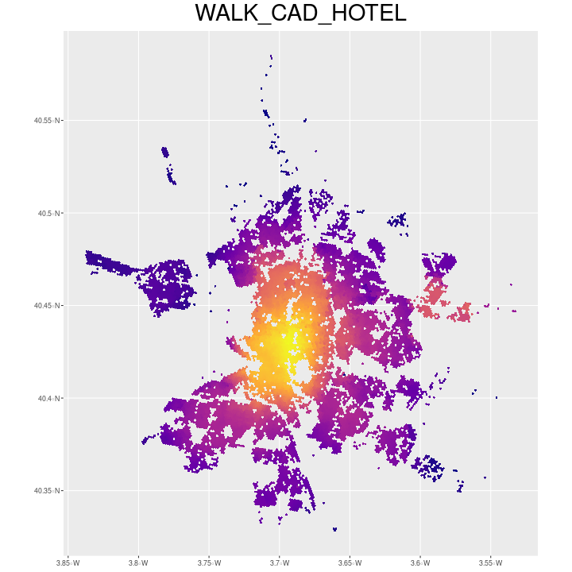
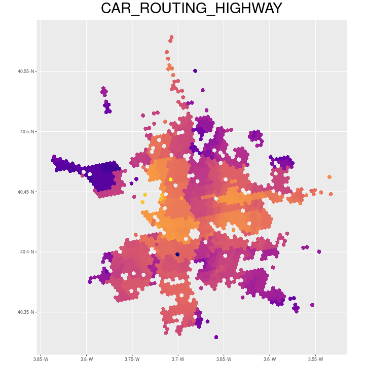

# Overview

It contains a serie of accessibility indices for H3 grid at 9 and 10 resolutions for the city of Madrid

{width=250px}
{width=250px}

# Folder organization

*data* folder contains csv files with indicator and their corresponding H3 indices and geometries, there are two sets one with CAR indices and a second one with WALK mode indices. Within this folder there are two index sets:

* __raw__ with the raw gravitational indices
* __boosted__ with the orthogonal gravitational indices (boosted)

The datasets use WKT (Well Known Text) for storing spatial features, coordinates are expressed in EPSG 4326 CRS.

# Indices categories

Indices have different nature and source, the following table contains which indices are available for each transportation mode and the source to build it. Walk indices are calculated for each H3 in the city at 10 resolution while Car are at 9th level.

|category          |subcategory |variable name      |measure |source   |CAR |WALK |
|:-----------------|:-----------|:------------------|:-------|:--------|:---|:----| 
|Public transport  |bus         |TRANSPORT.BUS      |count   |OSM      |x   |x    | 
|Public transport  |metro       |TRANSPORT.METRO    |count   |OSM      |x   |x    | 
|Public transport  |railway     |TRANSPORT.TRAIN    |count   |OSM      |x   |x    | 
|Public transport  |airport     |TRANSPORT.AIRPORT  |count   |OSM      |x   |     | 
|Private transport |highway     |ROUTING.HIGHWAY    |length  |OSM      |x   |x    |
|Private transport |routing     |ROUTING.COMPLEXITY |density |OSM      |x   |x    | 
|Urban amenities   |land        |CAD.URBANLAND      |area    |cadastre |x   |x    | 
|Urban amenities   |hotel       |HOTEL              |count   |OSM      |x   |x    | 
|Urban amenities   |hotel       |VACATIONAL         |count   |airbnb   |x   |x    | 
|Urban amenities   |food        |FOOD               |count   |OSM      |x   |x    | 
|Urban amenities   |tourism     |TOURISM            |count   |OSM      |x   |x    | 
|Urban amenities   |education   |CAD.PUBLIC         |area    |cadastre |x   |x    | 
|Urban amenities   |education   |CAD.SCHOOL         |area    |cadastre |x   |x    | 
|Urban amenities   |education   |EDUCATION          |count   |OSM      |x   |x    | 
|Urban amenities   |tourism     |TOURISM            |count   |OSM      |x   |x    | 
|Urban amenities   |health      |CAD.HEALTH         |area    |cadastre |x   |x    | 
|Urban amenities   |commerce    |SHOP               |count   |OSM      |x   |x    | 
|Urban amenities   |commerce    |CAD.COMMERCE       |area    |cadastre |x   |x    | 
|Urban amenities   |agriculture |CAD.AGRICULTURE    |area    |cadastre |x   |x    | 
|Urban amenities   |venues      |CAD.VENUES         |area    |cadastre |x   |x    | 
|Social            |religion    |CAD.RELIGION       |area    |cadastre |x   |x    | 
|Social            |residential |CAD.RESIDENTIAL    |area    |cadastre |x   |x    | 
|Recreational      |park        |PARK               |count   |OSM      |x   |x    | 
|Recreational      |sport       |CAD.SPORT          |area    |cadastre |x   |x    | 
|Recreational      |sport       |SPORT              |count   |OSM      |x   |x    |

<!--https://github.com/adam-p/markdown-here/wiki/Markdown-Cheatsheet#images-->